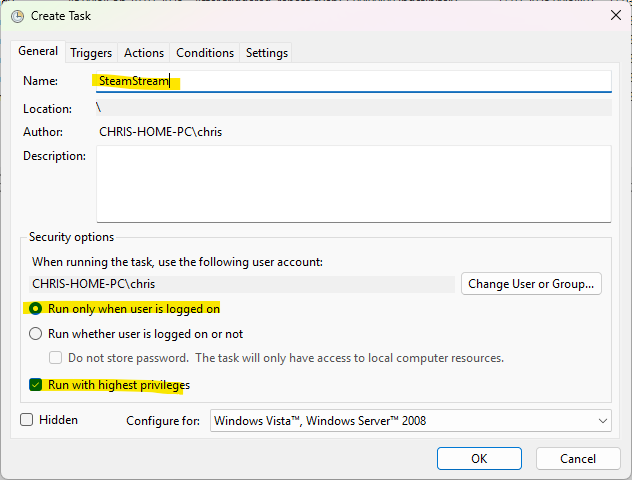
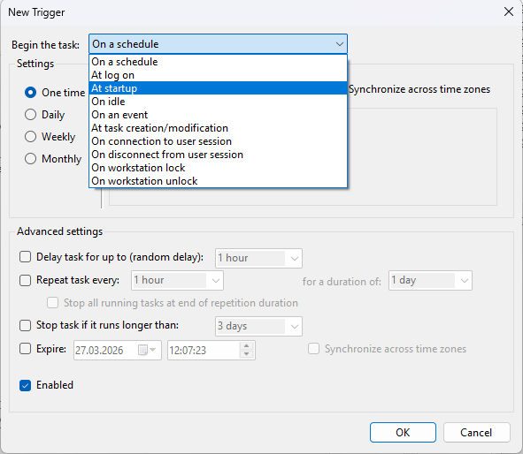
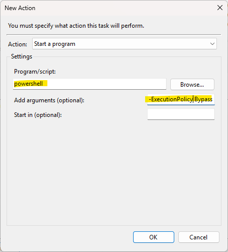
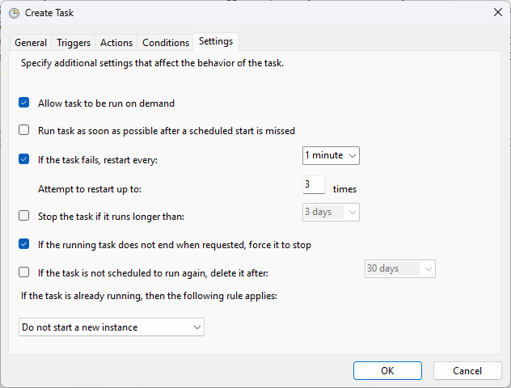

# Stream to Steam from Windows Powershell

This repository is an adaption of this https://github.com/cowleyforniastudios/steam-stream but for windows.
All the thanks to them for their work!

1. Install ffmpeg
   2. `winget install ffmpeg` 
   3. Or `choco install ffmpeg`. 
      4. Winget should already be installed on Windows 11 (as its from Microsoft), else you can install it or choco, follow the respective steps on their websites.

2. Clone this repository to a new folder
3. Put your video file in the same folder
4. Setup your Stream and get your Upload Token here: https://steamcommunity.com/broadcast/upload/
5. Open Powershell and navigate to that folder
6. Then call `.\steam_stream.ps1 .\<stream_file>.mp4 "<upload_token>"` from the powershell window
7. Voila, check your steam page, the stream should appear, but it may have a bit of a delay, so give it some time.

## Quality Settings

You can play around with the quality settings inside the file, there are variables for various settings like quality presets and stream resolution.

# Setting up this as a Task in Task Scheduler

You can set up this script as a task in windows task scheduler, then it will be executed once the pc turns on.

## 1. Open Task Scheduler

- Press `Win + S`, search for **Task Scheduler**, and open it.
- Click **Create Task...** in the right-hand panel.

## 2. Configure General Settings

- Name the task (e.g., `SteamStream`).
- Check **Run whether user is logged on or not**.
- Check **Run with highest privileges**.




## 3. Set the Trigger

- Go to the **Triggers** tab → click **New...**
- Set **Begin the task** to **At startup**, then click **OK**.



## 4. Set the Action

- Go to the **Actions** tab → click **New...**
- **Program/script**: `powershell`
- **Add arguments**:
  ```ps1
  -ExecutionPolicy Bypass -File "C:\full\path\to\steam_stream.ps1" "C:\full\path\to\stream_video.mp4" "<upload_token>"
  ```
  - To get the full path of a file you can navigate to the file in the File Explorer and then right-click and select "Copy as Path".
- Click **OK**.



## 5. Set Task to restart on fail

- Tick "If the tasks fails, restart every"
- Untick "Stop the task if it runs longer than"



## 6. Save and Test

- Click **OK** to save.
- Enter your password if prompted.
- Right-click the task and select **Run** to test.
